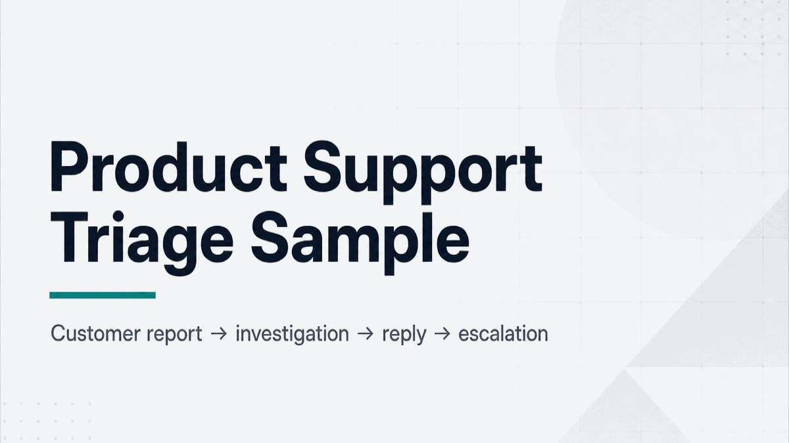
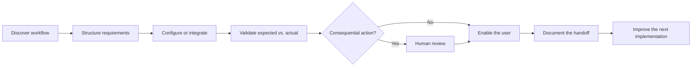

# Hi, I'm Chien Escalera Duong

**Implementation Systems · AI Enablement · Technical Operations**  
Workflow Discovery · Requirements · Technical Translation · Client Enablement · Validation  
Los Angeles, CA / Pacific Time · Open to remote-friendly implementation, AI enablement, solutions, and technical-operations roles

I turn messy real-world processes into workflows people can understand, test, and operate. My working loop is:

```text
Discover the workflow → define requirements and rules → configure the system
→ validate expected vs. actual → enable the user → document the handoff
```

I make complex tools feel usable: clear enough to trust, practical enough to operate, and documented enough to hand off.

I combine paid client delivery, high-volume customer operations, safety-critical production discipline, and hands-on AI-assisted systems work. I use AI to accelerate research, implementation, and documentation while remaining accountable for requirements, review, validation, and final decisions.

## Recruiter quick path

1. **[Review the paid client implementation](docs/PAID-CLIENT-IMPLEMENTATION-CASE-STUDY.md)** — discovery, requirements, GitHub/Vercel delivery, workflow setup, client enablement, and handoff
2. **[Read the autonomous systems case study](https://github.com/heyitschien/autonomous-lab-case-study)** — bounded requirements, integration sequencing, validation, and human risk gates
3. **[Visit Cousin Radio](https://cousinradio.com)** — shipped product work spanning discovery, requirements, troubleshooting, and deployment
4. **[See the AI-assisted QA workflow](https://github.com/heyitschien/chrome-extension-tester-mcp/blob/main/docs/SUPPORT-USE-CASE.md)** — repeatable screenshot, console, and expected-versus-actual evidence

## Featured proof

<table>
  <tr>
    <td width="33%" valign="top">
      <p><strong>Shipped product</strong><br />
      <a href="https://cousinradio.com">Cousin Radio</a></p>
      <p>
        <a href="https://cousinradio.com">
          
        </a>
      </p>
      <p>Public-beta product showing discovery, implementation, troubleshooting, validation, and deployment.</p>
      <p><a href="https://cousinradio.com"><strong>Visit the live product →</strong></a></p>
    </td>
    <td width="33%" valign="top">
      <p><strong>AI-assisted QA</strong><br />
      <a href="https://github.com/heyitschien/chrome-extension-tester-mcp/blob/main/docs/SUPPORT-USE-CASE.md">Chrome Extension Tester MCP</a></p>
      <p>
        <a href="https://github.com/heyitschien/chrome-extension-tester-mcp/blob/main/docs/SUPPORT-USE-CASE.md">
          
        </a>
      </p>
      <p>Working tool for repeatable screenshots, console evidence, and expected-versus-actual validation.</p>
      <p><a href="https://github.com/heyitschien/chrome-extension-tester-mcp/blob/main/docs/SUPPORT-USE-CASE.md"><strong>See the QA workflow →</strong></a></p>
    </td>
    <td width="33%" valign="top">
      <p><strong>Support judgment</strong><br />
      <a href="https://github.com/heyitschien/product-support-triage-sample/blob/main/CASE-OUTCOME.md">Product Support Triage Sample</a></p>
      <p>
        <a href="https://github.com/heyitschien/product-support-triage-sample/blob/main/CASE-OUTCOME.md">
          
        </a>
      </p>
      <p>Synthetic case showing calm triage, customer communication, and evidence-backed escalation.</p>
      <p><a href="https://github.com/heyitschien/product-support-triage-sample/blob/main/CASE-OUTCOME.md"><strong>Read the completed case →</strong></a></p>
    </td>
  </tr>
</table>

## Selected work

### Paid client website and lead-workflow implementation

Led discovery for a real-estate client, translated priorities into tracked implementation work, configured and delivered a Next.js web presence through GitHub and Vercel, supported domain and Google presence, and provided a client walkthrough and handoff. Client-private details remain private, and open dependencies are not presented as completed work.

### Autonomous systems case study

A public-safe implementation walkthrough showing bounded requirements, integration sequencing, expected-versus-actual validation, and human risk gates around AI-assisted systems work.

**[Read the case study →](https://github.com/heyitschien/autonomous-lab-case-study)**

### Career Development Operating System

A public-safe summary of a private GitHub-based operating system that researches and scores opportunities, tracks concurrent workstreams, packages evidence, and coordinates AI agents through durable handoffs. Applications, external messages, and irreversible decisions remain human-controlled.

**[Read the public-safe case study →](docs/CAREER-OPERATING-SYSTEM-CASE-STUDY.md)**

### Cousin Radio

A public-beta family music product showing the path from user observation to requirements, AI-assisted implementation, troubleshooting, validation, and deployment decisions.

**[Visit the product →](https://cousinradio.com)** · **[Review employer proof →](https://github.com/heyitschien/cousin-radio/blob/main/docs/EMPLOYER-PROOF.md)**

### AI-assisted QA and support evidence

A working open-source browser-testing tool and a synthetic support case showing how I collect evidence, compare expected versus actual behavior, communicate status, and hand off without making the next owner restart.

**[See the QA workflow →](https://github.com/heyitschien/chrome-extension-tester-mcp/blob/main/docs/SUPPORT-USE-CASE.md)** · **[Read the support case →](https://github.com/heyitschien/product-support-triage-sample/blob/main/CASE-OUTCOME.md)**

## What I bring

| Capability | Evidence |
| --- | --- |
| Workflow discovery and requirements | [Paid client case study](docs/PAID-CLIENT-IMPLEMENTATION-CASE-STUDY.md); [Cousin Radio employer proof](https://github.com/heyitschien/cousin-radio/blob/main/docs/EMPLOYER-PROOF.md) |
| AI coordination and human accountability | [Autonomous systems case study](https://github.com/heyitschien/autonomous-lab-case-study); [AI systems overview](docs/IMPLEMENTATION-AI-SYSTEMS.md) |
| Validation and failing-layer diagnosis | [Chrome Extension Tester MCP](https://github.com/heyitschien/chrome-extension-tester-mcp/blob/main/docs/SUPPORT-USE-CASE.md); [localization QA](https://github.com/heyitschien/next-i18next-sample/blob/main/docs/sample-bot-pr.md) |
| Client communication and enablement | Paid client walkthrough and handoff; [support case](https://github.com/heyitschien/product-support-triage-sample/blob/main/CASE-OUTCOME.md) |
| Product delivery and deployment | [Cousin Radio](https://cousinradio.com); [Chapter Reader](https://github.com/heyitschien/chapter-reader) |
| Documentation and reusable operations | [Career OS summary](docs/CAREER-OPERATING-SYSTEM-CASE-STUDY.md); [AI YouTube workflow](https://github.com/heyitschien/ai-youtube-content/blob/main/docs/production-workflow.md) |

## How I work

- Start with the person, process, and real friction.
- Convert ambiguity into requirements, owners, boundaries, and a success signal.
- Coordinate the right human, AI, and technical capabilities.
- Validate claims and outputs against evidence.
- Train the user and document the path.
- Keep consequential decisions human-owned.



AI accelerates research, implementation, and documentation; consequential decisions remain human-owned.

## Technical foundation

JavaScript · React · Next.js · HTML/CSS · GitHub · Vercel · REST API and JSON concepts · browser developer tools · Python and SQL fundamentals · workflow mapping · forms and validation logic · expected-versus-actual QA · Markdown documentation · Cursor · ChatGPT · Claude Code

## Background

- High-volume customer operations: Uber and Whole Foods
- Safety-critical collaboration: about ten years in film and television production
- Paid independent client implementation
- Certificates: Meta Front-End Developer, Google Cybersecurity, Google AI Essentials
- Continuing coursework and hands-on learning in Python, human systems, AI workflows, and web delivery

I am targeting work where technical systems meet real users: implementation, AI enablement, customer solutions, technical operations, and forward-deployed-style delivery.

## Contact

**LinkedIn:** [chien-escalera-duong](https://www.linkedin.com/in/chien-escalera-duong/)  
**Email:** [heyitschien@gmail.com](mailto:heyitschien@gmail.com)

[Why → How → What](docs/WHY-HOW-WHAT.md) · [AI attribution](docs/MODEL-AND-TOOL-ATTRIBUTION.md)
