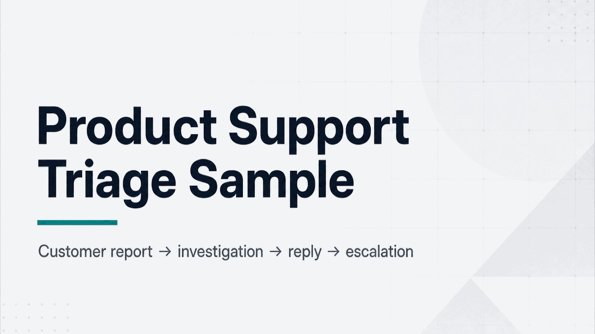
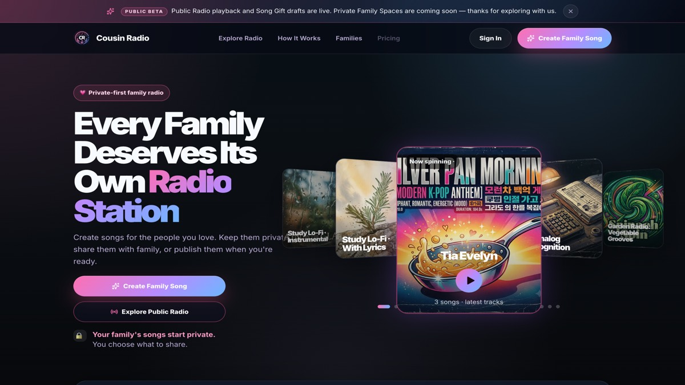
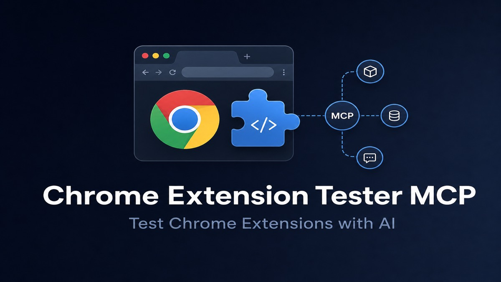

# Hi, I'm Chien Escalera Duong

**Implementation-minded operator · Product support generalist · AI workflow builder**  
Los Angeles, CA / Pacific Time · Open to remote Implementation, Onboarding, Product Support, Technical Support, and AI workflow operations roles

I help users and teams move from setup confusion to clear, documented next steps. My strength is calm customer-facing communication, structured troubleshooting, accurate handoffs, and turning messy workflows into repeatable operating notes.

---

## Recruiter quick path (~3 minutes)

1. **[Read the completed support case](https://github.com/heyitschien/product-support-triage-sample/blob/main/CASE-OUTCOME.md)** — ticket ownership, customer reply, escalation
2. **[Visit the live product](https://cousinradio.com)** — Cousin Radio · [Review employer proof](https://github.com/heyitschien/cousin-radio/blob/main/docs/EMPLOYER-PROOF.md)
3. **[See the QA workflow](https://github.com/heyitschien/chrome-extension-tester-mcp/blob/main/docs/SUPPORT-USE-CASE.md)** — AI-assisted validation with screenshots and logs

---

## Flagship proof

<table>
  <tr>
    <td width="33%" valign="top">
      <p><strong>Support judgment</strong><br />
      <a href="https://github.com/heyitschien/product-support-triage-sample/blob/main/CASE-OUTCOME.md">Product Support Triage Sample</a></p>
      <p>
        <a href="https://github.com/heyitschien/product-support-triage-sample/blob/main/CASE-OUTCOME.md">
          
        </a>
      </p>
      <p>Synthetic case: calm triage, customer communication, and evidence-backed escalation.</p>
      <p><a href="https://github.com/heyitschien/product-support-triage-sample/blob/main/CASE-OUTCOME.md"><strong>Read the completed case →</strong></a></p>
    </td>
    <td width="33%" valign="top">
      <p><strong>Shipped product</strong><br />
      <a href="https://cousinradio.com">Cousin Radio</a></p>
      <p>
        <a href="https://cousinradio.com">
          
        </a>
      </p>
      <p>Public-beta family music product with deployment ownership and layered troubleshooting proof.</p>
      <p><a href="https://cousinradio.com"><strong>Visit the live product →</strong></a></p>
    </td>
    <td width="33%" valign="top">
      <p><strong>AI-assisted QA</strong><br />
      <a href="https://github.com/heyitschien/chrome-extension-tester-mcp/blob/main/docs/SUPPORT-USE-CASE.md">Chrome Extension Tester MCP</a></p>
      <p>
        <a href="https://github.com/heyitschien/chrome-extension-tester-mcp/blob/main/docs/SUPPORT-USE-CASE.md">
          
        </a>
      </p>
      <p>Working open-source tool for repeatable screenshot and console evidence in extension support.</p>
      <p><a href="https://github.com/heyitschien/chrome-extension-tester-mcp/blob/main/docs/SUPPORT-USE-CASE.md"><strong>See the QA workflow →</strong></a></p>
    </td>
  </tr>
</table>

---

## How I work

```text
Intake → clarify expected behavior → collect evidence → identify the failing layer
→ communicate status → resolve or escalate → document the outcome
```

I compare expected vs. actual behavior, capture evidence early, communicate status clearly, and hand off with enough context that the next owner does not restart the investigation.

---

## Capabilities at a glance

| Capability | Strongest public evidence |
| --- | --- |
| Support ownership, customer communication, and escalation | [Read the completed case](https://github.com/heyitschien/product-support-triage-sample/blob/main/CASE-OUTCOME.md) · [View the customer response](https://github.com/heyitschien/product-support-triage-sample/blob/main/customer-reply.md) · [See the escalation handoff](https://github.com/heyitschien/product-support-triage-sample/blob/main/internal-escalation-note.md) |
| Troubleshooting, QA, and evidence gathering | [See the QA workflow](https://github.com/heyitschien/chrome-extension-tester-mcp/blob/main/docs/SUPPORT-USE-CASE.md) · [Explore the localization demo](https://github.com/heyitschien/next-i18next-sample/blob/main/docs/sample-bot-pr.md) |
| Product delivery and deployment | [Visit the live product](https://cousinradio.com) · [Review employer proof](https://github.com/heyitschien/cousin-radio/blob/main/docs/EMPLOYER-PROOF.md) |
| Documentation and workflow systems | [Chapter Reader](https://github.com/heyitschien/chapter-reader) · [AI YouTube production workflow](https://github.com/heyitschien/ai-youtube-content/blob/main/docs/production-workflow.md) |
| AI-assisted orchestration and validation | [Capability overview](docs/AI-ORCHESTRATED-SYSTEMS-ENGINEERING.md) · [Case studies](docs/AI-WORKFLOW-CASE-STUDIES.md) |

---

## Supporting work

| Project | Capability | Status | Start here |
| --- | --- | --- | --- |
| **Chapter Reader** | Local app delivery / setup clarity | Shipped Mac utility | [Open the project](https://github.com/heyitschien/chapter-reader) |
| **LingoPilot demo** | Localization / config QA | Public concept demo | [Explore the localization demo](https://github.com/heyitschien/next-i18next-sample/blob/main/docs/sample-bot-pr.md) |
| **AI YouTube Content** | Content-system design | Active content ops repo | [Review the production workflow](https://github.com/heyitschien/ai-youtube-content/blob/main/docs/production-workflow.md) |

---

## AI-assisted workflow

I coordinate AI tools, repositories, documentation, and validation to turn unclear problems into reviewable, evidence-backed work. Repeatable loop: question → research → challenge → synthesis → architecture → implementation → evidence → revision. I remain accountable for framing, decisions, review, and acceptance.

[Capability overview](docs/AI-ORCHESTRATED-SYSTEMS-ENGINEERING.md) · [Case studies](docs/AI-WORKFLOW-CASE-STUDIES.md) · [Attribution](docs/MODEL-AND-TOOL-ATTRIBUTION.md)

---

## Background

* High-volume customer-facing operations: Uber, Whole Foods
* Safety-critical production teamwork: film / stunt work
* Technical learning: JavaScript, React, Next.js, GitHub, REST API concepts, browser developer tools, Cursor, AI-assisted workflows
* Certifications: Meta Front-End Developer, Google Cybersecurity, Google AI Essentials

I bring a customer-facing technical-operations perspective: learning systems quickly, troubleshooting calmly, documenting clearly, and helping users move successfully from setup through launch.

---

## Contact

**LinkedIn:** [heyitschien](https://www.linkedin.com/in/heyitschien/)  
**Email:** [heyitschien@gmail.com](mailto:heyitschien@gmail.com)
