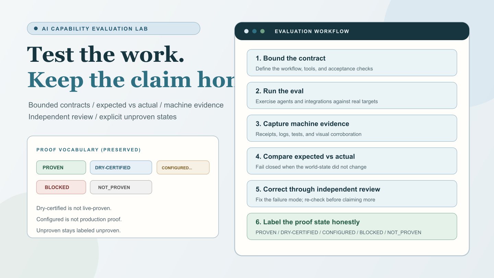
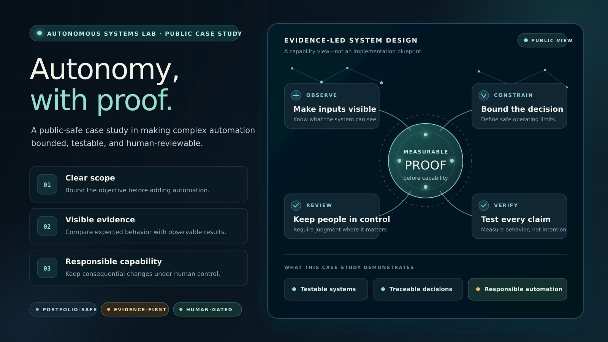

# Hi, I'm Chien Escalera Duong

## AI Implementation · Technical Solutions

**I help people do more meaningful work by removing unnecessary friction with AI.**

I turn ambiguous workflows into working, testable systems by learning how the work happens, translating it into requirements, configuring and integrating the right tools, validating expected versus actual behavior, and leaving a usable handoff.

**Target roles:** AI Implementation Specialist · customer-facing technical solutions roles where real operational needs must become reliable, usable systems

Los Angeles, California · Pacific Time

**[Portfolio evidence](#start-here)** · **[LinkedIn](https://www.linkedin.com/in/chien-escalera-duong/)** · **[Email](mailto:heyitschien@gmail.com)**

```text
Discover → Structure → Configure & Integrate → Validate → Enable → Document → Improve
```

## Start here

<!-- markdownlint-disable MD033 -->
<details open>
  <summary><strong>01 · Paid independent implementation</strong> · Client Implementation</summary>

<p align="center">
  <a href="docs/PAID-CLIENT-IMPLEMENTATION-CASE-STUDY.md">
    
  </a>
</p>

Took a real client need from discovery into a client-operable production system: public Next.js experience, client-owned GitHub → Vercel path, consultation lead intake into Google Sheets, duplicate-submission protection, Safari/Chrome and mobile validation, seller-guide enablement surfaces, documentation, and ongoing iteration. Client identity and private details stay protected.

**[Read the case study →](docs/PAID-CLIENT-IMPLEMENTATION-CASE-STUDY.md)**
</details>

<details>
  <summary><strong>02 · AI capability evaluation lab</strong> · Can AI Yet?</summary>

<p align="center">
  <a href="docs/CAN-AI-YET-CASE-STUDY.md">
    
  </a>
</p>

A working evaluation system for testing whether AI agents and tool integrations can perform real business workflows reliably. I define bounded contracts, build evals, run expected-vs-actual checks, preserve machine receipts and visual evidence, correct failures through independent review, and keep unproven capabilities explicitly unproven — using proof states such as PROVEN, DRY-CERTIFIED, CONFIGURED_NOT_LIVE_PROVEN, BLOCKED, and NOT_PROVEN.

The live product is an **early alpha under active development**; its interface, catalog, and evidence will continue to change. The public case study is the canonical recruiter-facing evidence summary.

**[Read the visual summary →](docs/CAN-AI-YET-CASE-STUDY.md)** · **[Explore the public case study →](https://github.com/heyitschien/can-ai-yet-case-study)** · **[Open the live alpha →](https://canaiyet.com)**
</details>

<details>
  <summary><strong>03 · Working open-source agent tooling</strong> · Chrome Extension Tester MCP</summary>

<p align="center">
  <a href="https://github.com/heyitschien/chrome-extension-tester-mcp">
    
  </a>
</p>

Built an open-source MCP and Playwright developer tool that lets AI agents launch, inspect, test, and collect browser evidence from Chrome extensions.

**[Explore the project →](https://github.com/heyitschien/chrome-extension-tester-mcp)** · **[Read the support/QA walkthrough →](https://github.com/heyitschien/chrome-extension-tester-mcp/blob/main/docs/SUPPORT-USE-CASE.md)**
</details>

<details>
  <summary><strong>04 · Public-safe systems case study</strong> · Autonomous Systems Lab</summary>

<p align="center">
  <a href="https://github.com/heyitschien/autonomous-lab-case-study">
    
  </a>
</p>

A public-safe case study showing how I turn complex systems work into bounded requirements, sequenced integrations, observable validation, documented ownership, and human review before consequential actions. It is research documentation, not a production financial system.

The rendered report is a **historical snapshot reconciled through 2026-08-26** and publicly refreshed on 2026-09-21. It does not claim current runtime readiness, profitable trading, positive expectancy, or live brokerage execution.

**[Review the case-study repository →](https://github.com/heyitschien/autonomous-lab-case-study)** · **[Open the visual report →](https://heyitschien.github.io/autonomous-lab-case-study/)** · **[Read the full markdown →](https://github.com/heyitschien/autonomous-lab-case-study/blob/main/PUBLIC-CASE-STUDY.md)**
</details>

<details>
  <summary><strong>05 · Shipped public-beta product</strong> · Cousin Radio</summary>

<p align="center">
  <a href="https://cousinradio.com">
    
  </a>
</p>

Led a live public-beta family music product from user observation through requirements, AI-assisted implementation, troubleshooting, QA, deployment, and continued iteration.

**[Visit the live product →](https://cousinradio.com)** · **[Review the employer evidence →](https://github.com/heyitschien/cousin-radio/blob/main/docs/EMPLOYER-PROOF.md)** · **[Explore the public showcase →](https://github.com/heyitschien/cousin-radio)**
</details>
<!-- markdownlint-enable MD033 -->

## What I can own

| Capability | What that means in practice | Evidence |
| --- | --- | --- |
| **Workflow discovery and scoping** | Understand the user, current process, friction, dependencies, constraints, and definition of success. | [Paid client implementation](docs/PAID-CLIENT-IMPLEMENTATION-CASE-STUDY.md) · [Cousin Radio](https://github.com/heyitschien/cousin-radio/blob/main/docs/EMPLOYER-PROOF.md) |
| **Requirements and system design** | Convert ambiguity into business rules, acceptance criteria, owners, boundaries, and an executable implementation path. | [Paid client implementation](docs/PAID-CLIENT-IMPLEMENTATION-CASE-STUDY.md) · [Can AI Yet?](docs/CAN-AI-YET-CASE-STUDY.md) · [Autonomous Systems Lab](https://github.com/heyitschien/autonomous-lab-case-study) |
| **Configuration and integration** | Connect tools, interfaces, environments, data flows, and deployment workflows in a deliberate sequence. | [Paid client implementation](docs/PAID-CLIENT-IMPLEMENTATION-CASE-STUDY.md) · [Can AI Yet?](docs/CAN-AI-YET-CASE-STUDY.md) · [Cousin Radio](https://cousinradio.com) |
| **Validation and diagnosis** | Compare expected versus actual behavior using tests, logs, screenshots, browser evidence, CI, and repeatable checks. | [Can AI Yet?](docs/CAN-AI-YET-CASE-STUDY.md) · [Paid client implementation](docs/PAID-CLIENT-IMPLEMENTATION-CASE-STUDY.md) · [Chrome Extension Tester MCP](https://github.com/heyitschien/chrome-extension-tester-mcp) |
| **User enablement and handoff** | Explain the system clearly, conduct walkthroughs, document ownership, separate completed work from open dependencies, and leave a usable next step. | [Paid client implementation](docs/PAID-CLIENT-IMPLEMENTATION-CASE-STUDY.md) · [Career Development OS](docs/CAREER-OPERATING-SYSTEM-CASE-STUDY.md) |
| **AI workflow evaluation** | Design evals, preserve machine evidence, run correction/review loops, and keep unproven capabilities labeled unproven. | [Can AI Yet?](docs/CAN-AI-YET-CASE-STUDY.md) · [Implementation + AI systems](docs/IMPLEMENTATION-AI-SYSTEMS.md) |
| **AI-assisted execution** | Coordinate AI tools for research, implementation, testing, and documentation while keeping human accountability and approval explicit. | [Implementation + AI systems](docs/IMPLEMENTATION-AI-SYSTEMS.md) · [Model and tool attribution](docs/MODEL-AND-TOOL-ATTRIBUTION.md) |

## How I work

- Start with the person, the workflow, the real friction, and a clear definition of success.
- Make constraints, ownership, and human-controlled decisions explicit.
- Translate ambiguity into requirements, business rules, acceptance criteria, and tracked work.
- Sequence implementation around dependencies, risk, and the fastest path to trustworthy evidence.
- Use AI and technical tools to extend my speed and range without outsourcing judgment.
- Validate expected versus actual behavior, then enable the user with clear documentation and handoff.

## AI implementation and accountability

AI accelerates research, implementation, testing, and documentation. I remain responsible for scope, requirements, privacy, review, validation, communication, consequential decisions, and final approval; model output becomes evidence only when supported by working software, tests, logs, screenshots, documented decisions, or a reproducible workflow.

**[Read how I use AI and technical tools →](docs/MODEL-AND-TOOL-ATTRIBUTION.md)**

## Supporting systems

- **[Career Development Operating System](docs/CAREER-OPERATING-SYSTEM-CASE-STUDY.md)** — a public-safe view of a private workflow system for research, prioritization, evidence routing, agent coordination, durable handoffs, and human decision gates.
- **[Chapter Reader](https://github.com/heyitschien/chapter-reader)** — a shipped utility demonstrating product setup, documentation, and practical delivery.
- **[Localization QA demo](https://github.com/heyitschien/next-i18next-sample/blob/main/docs/sample-bot-pr.md)** — configuration and validation evidence for multilingual product behavior.
- **[Product Support Triage Sample](https://github.com/heyitschien/product-support-triage-sample/blob/main/CASE-OUTCOME.md)** — a synthetic supporting case showing calm investigation, customer communication, evidence collection, and escalation.

## Technical foundation

JavaScript · React · Next.js · HTML/CSS · GitHub · Vercel · REST API and JSON concepts · Model Context Protocol · Playwright · browser developer tools · Python and SQL fundamentals · workflow mapping · forms and validation logic · expected-versus-actual QA · CI and deployment awareness · Markdown documentation · Cursor · ChatGPT · Claude Code · Gemini

## Background

- 7,000+ customer-facing interactions with a 4.9-star service record
- Current experience in high-volume customer operations
- Approximately ten years in safety-critical film and television production
- Paid independent client implementation and handoff experience
- Meta Front-End Developer, Google Cybersecurity, and Google AI Essentials certificates
- Continuing hands-on development in AI workflows, technical implementation, web delivery, Python, and human-centered systems

My background taught me to stay calm around complexity, communicate clearly across different kinds of people, adapt quickly when conditions change, and remain accountable for the final result.

## Contact

**LinkedIn:** [chien-escalera-duong](https://www.linkedin.com/in/chien-escalera-duong/)  
**Email:** [heyitschien@gmail.com](mailto:heyitschien@gmail.com)

[Why → How → What](docs/WHY-HOW-WHAT.md) · [Capability evidence](docs/CAPABILITY-EVIDENCE-MAP.md) · [AI attribution](docs/MODEL-AND-TOOL-ATTRIBUTION.md)
