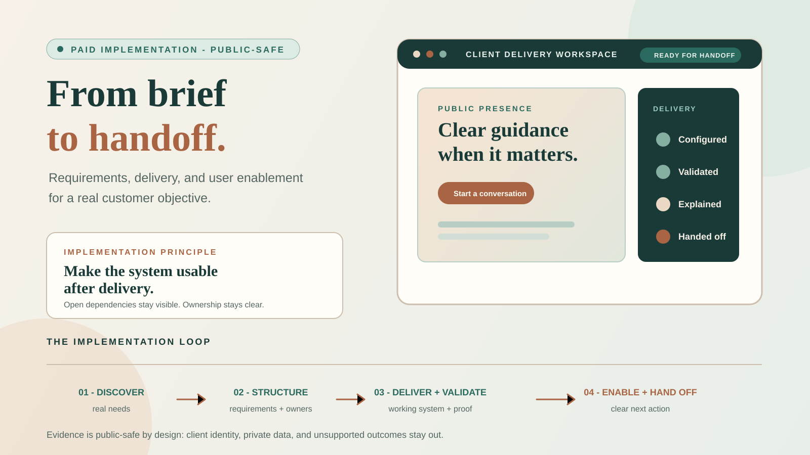
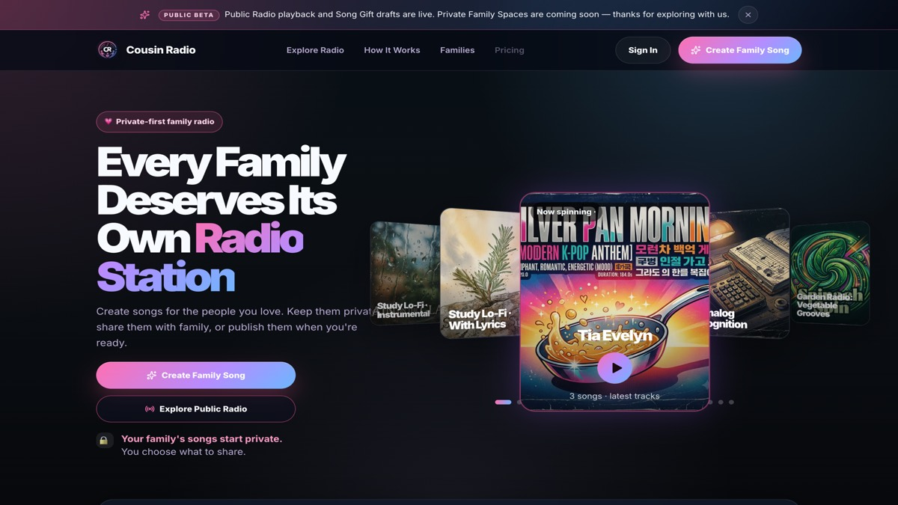
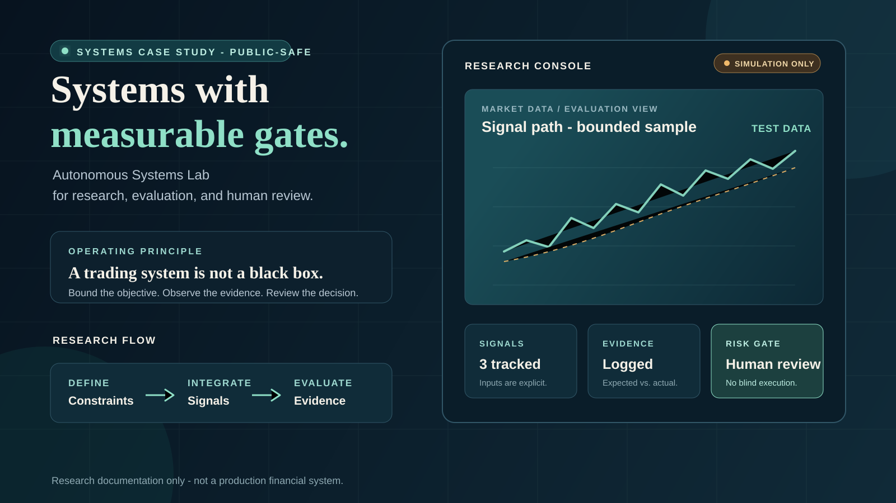
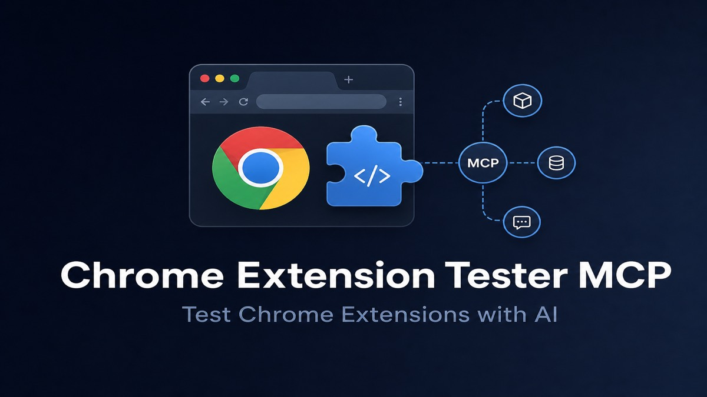
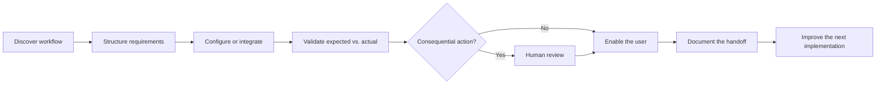

# Hi, I'm Chien Escalera Duong

## AI Implementation & Systems Builder

I turn ambiguous real-world workflows into working, testable systems—from discovery and requirements through integration, validation, user enablement, and handoff.

My strongest work sits between people, operations, and technology. I learn how the work actually happens, translate that understanding into requirements and business rules, coordinate implementation, verify expected versus actual behavior, and leave behind documentation another person can use.

I use AI to expand my speed and technical range while remaining accountable for objectives, scope, requirements, architecture, privacy, validation, communication, consequential decisions, and final approval.

**Los Angeles, California · Pacific Time**<br />
Best fit: customer-facing AI implementation and technical solutions work where real operational needs must become reliable systems.

```text
Discover → Structure → Configure & Integrate → Validate → Enable → Document → Improve
```

## Start here

<table>
  <tr>
    <td width="50%" valign="top">
      <p><strong>01 · Paid independent implementation</strong><br />
      <a href="docs/PAID-CLIENT-IMPLEMENTATION-CASE-STUDY.md"><strong>Client Implementation</strong></a></p>
      <p>
        <a href="docs/PAID-CLIENT-IMPLEMENTATION-CASE-STUDY.md">
          
        </a>
      </p>
      <p>Led a paid client engagement from discovery through delivery and handoff: requirements, tracked implementation, Next.js delivery through GitHub and Vercel, domain and Google-presence support, validation, client walkthrough, and documented next actions. Client identity and private details stay protected.</p>
      <p><a href="docs/PAID-CLIENT-IMPLEMENTATION-CASE-STUDY.md"><strong>Read the case study →</strong></a></p>
    </td>
    <td width="50%" valign="top">
      <p><strong>02 · Shipped product</strong><br />
      <a href="https://cousinradio.com"><strong>Cousin Radio</strong></a></p>
      <p>
        <a href="https://cousinradio.com">
          
        </a>
      </p>
      <p>Led a live family music product from user observation through requirements, AI-assisted implementation, troubleshooting, QA, deployment, and continued iteration.</p>
      <p><a href="https://cousinradio.com"><strong>Visit the live product →</strong></a> · <a href="https://github.com/heyitschien/cousin-radio/blob/main/docs/EMPLOYER-PROOF.md"><strong>Review the evidence →</strong></a></p>
    </td>
  </tr>
  <tr>
    <td width="50%" valign="top">
      <p><strong>03 · Public-safe systems case study</strong><br />
      <a href="https://github.com/heyitschien/autonomous-lab-case-study"><strong>Autonomous Systems Lab</strong></a></p>
      <p>
        <a href="https://github.com/heyitschien/autonomous-lab-case-study">
          
        </a>
      </p>
      <p>A public-safe case study showing how I turn complex systems work into bounded requirements, sequenced integrations, observable validation, documented ownership, and human review before consequential actions. It is research documentation, not a production financial system.</p>
      <p><a href="https://github.com/heyitschien/autonomous-lab-case-study"><strong>Review the case study →</strong></a></p>
    </td>
    <td width="50%" valign="top">
      <p><strong>04 · Working open-source agent tooling</strong><br />
      <a href="https://github.com/heyitschien/chrome-extension-tester-mcp"><strong>Chrome Extension Tester MCP</strong></a></p>
      <p>
        <a href="https://github.com/heyitschien/chrome-extension-tester-mcp">
          
        </a>
      </p>
      <p>Built an open-source MCP and Playwright developer tool that lets AI agents launch, inspect, test, and collect browser evidence from Chrome extensions.</p>
      <p><a href="https://github.com/heyitschien/chrome-extension-tester-mcp"><strong>Explore the project →</strong></a></p>
    </td>
  </tr>
</table>

## What I can own

| Capability | What that means in practice | Evidence |
| --- | --- | --- |
| **Workflow discovery and scoping** | Understand the user, current process, friction, dependencies, constraints, and definition of success. | [Paid client implementation](docs/PAID-CLIENT-IMPLEMENTATION-CASE-STUDY.md) · [Cousin Radio](https://github.com/heyitschien/cousin-radio/blob/main/docs/EMPLOYER-PROOF.md) |
| **Requirements and system design** | Convert ambiguity into business rules, acceptance criteria, owners, boundaries, and an executable implementation path. | [Autonomous Systems Lab](https://github.com/heyitschien/autonomous-lab-case-study) · [Implementation + AI systems](docs/IMPLEMENTATION-AI-SYSTEMS.md) |
| **Configuration and integration** | Connect tools, interfaces, environments, data flows, and deployment workflows in a deliberate sequence. | [Cousin Radio](https://cousinradio.com) · [Chrome Extension Tester MCP](https://github.com/heyitschien/chrome-extension-tester-mcp) |
| **Validation and diagnosis** | Compare expected versus actual behavior using tests, logs, screenshots, browser evidence, CI, and repeatable checks. | [Chrome Extension Tester MCP](https://github.com/heyitschien/chrome-extension-tester-mcp) · [Autonomous Systems Lab](https://github.com/heyitschien/autonomous-lab-case-study) |
| **User enablement and handoff** | Explain the system clearly, conduct walkthroughs, document ownership, separate completed work from open dependencies, and leave a usable next step. | [Paid client implementation](docs/PAID-CLIENT-IMPLEMENTATION-CASE-STUDY.md) · [Career Development OS](docs/CAREER-OPERATING-SYSTEM-CASE-STUDY.md) |
| **AI-assisted execution** | Coordinate AI tools for research, implementation, testing, and documentation while keeping human accountability and approval explicit. | [Implementation + AI systems](docs/IMPLEMENTATION-AI-SYSTEMS.md) · [Model and tool attribution](docs/MODEL-AND-TOOL-ATTRIBUTION.md) |

## How I work

- Start with the person, the process, and the real operational friction.
- Define success, constraints, ownership, and what must remain human-controlled.
- Translate ambiguity into requirements, business rules, acceptance criteria, and tracked work.
- Sequence implementation around dependencies, risk, and the fastest path to trustworthy evidence.
- Use AI and technical tools to extend my speed and range without outsourcing judgment.
- Validate expected versus actual behavior before presenting work as complete.
- Enable the user through clear communication, walkthroughs, documentation, and handoff.
- Turn repeated learning into reusable workflows, playbooks, and system improvements.


```mermaid
flowchart LR
    discover["Discover workflow"] --> requirements["Structure requirements"]
    requirements --> configure["Configure or integrate"]
    configure --> validate["Validate expected vs. actual"]
    validate --> humanGate{"Consequential action?"}
    humanGate -->|"Yes"| humanReview["Human review"]
    humanGate -->|"No"| enable["Enable the user"]
    humanReview --> enable
    enable --> handoff["Document the handoff"]
    handoff --> improve["Improve the next implementation"]
```

## AI implementation and accountability

AI accelerates my research, implementation, testing, and documentation. I remain responsible for defining the objective, setting boundaries, deciding requirements, reviewing outputs, validating behavior, protecting privacy, communicating status, and approving the final result.

I do not present AI-generated output as proof by itself. A claim becomes credible when it is supported by working software, tests, logs, screenshots, deployment evidence, documented decisions, or a reproducible workflow.

**[Read how I use AI and technical tools →](docs/MODEL-AND-TOOL-ATTRIBUTION.md)**

## Supporting systems

- **[Career Development Operating System](docs/CAREER-OPERATING-SYSTEM-CASE-STUDY.md)** — a public-safe view of a private workflow system for research, prioritization, evidence routing, agent coordination, durable handoffs, and human decision gates.
- **[Chapter Reader](https://github.com/heyitschien/chapter-reader)** — a shipped utility demonstrating product setup, documentation, and practical delivery.
- **[Localization QA demo](https://github.com/heyitschien/next-i18next-sample/blob/main/docs/sample-bot-pr.md)** — configuration and validation evidence for multilingual product behavior.
- **[Product Support Triage Sample](https://github.com/heyitschien/product-support-triage-sample/blob/main/CASE-OUTCOME.md)** — a synthetic supporting case showing calm investigation, customer communication, evidence collection, and escalation.

## Technical foundation

JavaScript · React · Next.js · HTML/CSS · GitHub · Vercel · REST API and JSON concepts · Model Context Protocol · Playwright · browser developer tools · Python and SQL fundamentals · workflow mapping · forms and validation logic · expected-versus-actual QA · CI and deployment awareness · Markdown documentation · Cursor · ChatGPT · Claude Code · Gemini

## Background

- Thousands of independent customer interactions with a 4.9-star service record
- Current experience in high-volume customer operations
- Approximately ten years in safety-critical film and television production
- Paid independent client implementation and handoff experience
- Meta Front-End Developer, Google Cybersecurity, and Google AI Essentials certificates
- Continuing hands-on development in AI workflows, technical implementation, web delivery, Python, and human-centered systems

My background taught me to stay calm around complexity, communicate clearly across different kinds of people, adapt quickly when conditions change, and remain accountable for the final result.

## Contact

**LinkedIn:** [chien-escalera-duong](https://www.linkedin.com/in/chien-escalera-duong/)  
**Email:** [heyitschien@gmail.com](mailto:heyitschien@gmail.com)

[Why → How → What](docs/WHY-HOW-WHAT.md) · [Capability evidence](docs/CAPABILITY-EVIDENCE-MAP.md) · [Evidence registry](docs/PORTFOLIO-EVIDENCE-REGISTRY.md) · [AI attribution](docs/MODEL-AND-TOOL-ATTRIBUTION.md)
