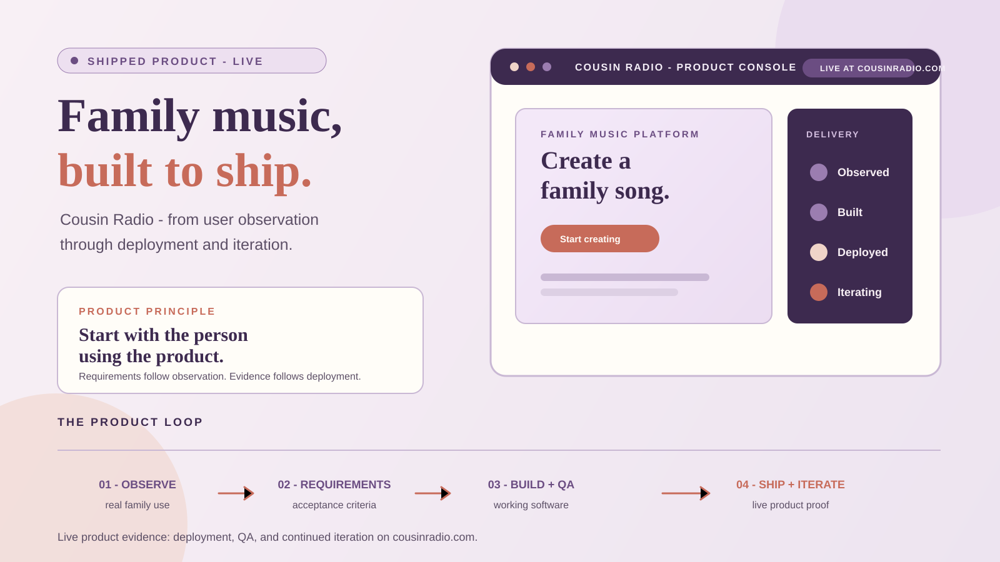
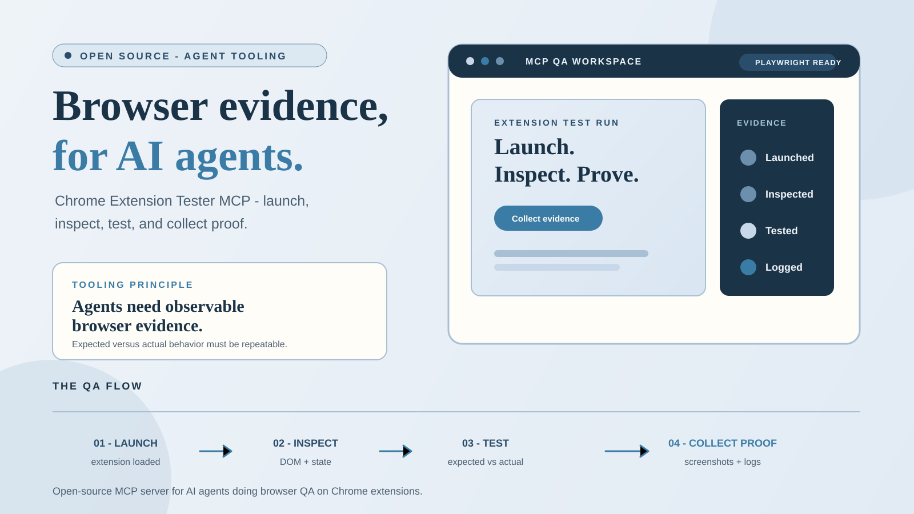
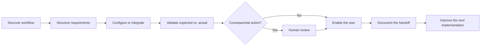

# Hi, I'm Chien Escalera Duong

## AI Implementation & Systems Builder

I turn ambiguous real-world workflows into working, testable systems—from discovery through delivery, validation, and handoff.

I sit between people, operations, and technology: translate real work into requirements, coordinate implementation, verify expected versus actual behavior, and leave documentation another person can use. I use AI for speed and range—and stay accountable for scope, privacy, validation, and final approval.

Los Angeles, California · Pacific Time · Thousands of customer interactions · 4.9-star service record · Paid client delivery

Best fit: customer-facing AI implementation and technical solutions work where operational needs must become reliable systems.

```text
Discover → Structure → Configure & Integrate → Validate → Enable → Document → Improve
```

**New here?** Start with **01** (paid delivery), then **[What I can own](#what-i-can-own)** if you're hiring.

## Start here

<!-- markdownlint-disable MD033 -->
<details open>
  <summary><strong>01 · Paid independent implementation</strong> · Client Implementation</summary>

<p align="center">
  <a href="docs/PAID-CLIENT-IMPLEMENTATION-CASE-STUDY.md">
    
  </a>
</p>

Led a paid client engagement from discovery through delivery and handoff: requirements, tracked implementation, Next.js delivery through GitHub and Vercel, domain and Google-presence support, validation, client walkthrough, and documented next actions. Client identity and private details stay protected.

**[Read the case study →](docs/PAID-CLIENT-IMPLEMENTATION-CASE-STUDY.md)**
</details>

<details>
  <summary><strong>02 · Shipped product</strong> · Cousin Radio</summary>

<p align="center">
  <a href="https://cousinradio.com">
    
  </a>
</p>

Led a live family music product from user observation through requirements, AI-assisted implementation, troubleshooting, QA, deployment, and continued iteration.

**[Visit the live product →](https://cousinradio.com)** · **[Review the evidence →](https://github.com/heyitschien/cousin-radio/blob/main/docs/EMPLOYER-PROOF.md)**
</details>

<details>
  <summary><strong>03 · Public-safe systems case study</strong> · Autonomous Systems Lab</summary>

<p align="center">
  <a href="https://github.com/heyitschien/autonomous-lab-case-study">
    
  </a>
</p>

A public-safe case study showing how I turn complex systems work into bounded requirements, sequenced integrations, observable validation, documented ownership, and human review before consequential actions. It is research documentation, not a production financial system.

**[Review the case study →](https://github.com/heyitschien/autonomous-lab-case-study)**
</details>

<details>
  <summary><strong>04 · Working open-source agent tooling</strong> · Chrome Extension Tester MCP</summary>

<p align="center">
  <a href="https://github.com/heyitschien/chrome-extension-tester-mcp">
    
  </a>
</p>

Built an open-source MCP and Playwright developer tool that lets AI agents launch, inspect, test, and collect browser evidence from Chrome extensions.

**[Explore the project →](https://github.com/heyitschien/chrome-extension-tester-mcp)**
</details>
<!-- markdownlint-enable MD033 -->

## What I can own

| Capability | What that means in practice | Evidence |
| --- | --- | --- |
| **Workflow discovery and scoping** | Understand the user, current process, friction, dependencies, constraints, and definition of success. | [Paid client implementation](docs/PAID-CLIENT-IMPLEMENTATION-CASE-STUDY.md) · [Cousin Radio](https://github.com/heyitschien/cousin-radio/blob/main/docs/EMPLOYER-PROOF.md) |
| **Requirements and system design** | Convert ambiguity into business rules, acceptance criteria, owners, boundaries, and an executable implementation path. | [Autonomous Systems Lab](https://github.com/heyitschien/autonomous-lab-case-study) · [Implementation + AI systems](docs/IMPLEMENTATION-AI-SYSTEMS.md) |
| **Configuration and integration** | Connect tools, interfaces, environments, data flows, and deployment workflows in a deliberate sequence. | [Cousin Radio](https://cousinradio.com) · [Chrome Extension Tester MCP](https://github.com/heyitschien/chrome-extension-tester-mcp) |
| **Validation and diagnosis** | Compare expected versus actual behavior using tests, logs, screenshots, browser evidence, CI, and repeatable checks. | [Chrome Extension Tester MCP](https://github.com/heyitschien/chrome-extension-tester-mcp) · [Autonomous Systems Lab](https://github.com/heyitschien/autonomous-lab-case-study) |
| **User enablement and handoff** | Explain the system clearly, conduct walkthroughs, document ownership, separate completed work from open dependencies, and leave a usable next step. | [Paid client implementation](docs/PAID-CLIENT-IMPLEMENTATION-CASE-STUDY.md) · [Career Development OS](docs/CAREER-OPERATING-SYSTEM-CASE-STUDY.md) |
| **AI-assisted execution** | Coordinate AI tools for research, implementation, testing, and documentation while keeping human accountability and approval explicit. | [Implementation + AI systems](docs/IMPLEMENTATION-AI-SYSTEMS.md) · [Model and tool attribution](docs/MODEL-AND-TOOL-ATTRIBUTION.md) |

## How I work

- Start with the person, the process, and the real operational friction.
- Define success, constraints, ownership, and what must remain human-controlled.
- Translate ambiguity into requirements, business rules, acceptance criteria, and tracked work.
- Sequence implementation around dependencies, risk, and the fastest path to trustworthy evidence.
- Use AI and technical tools to extend my speed and range without outsourcing judgment.
- Validate expected versus actual behavior before presenting work as complete.
- Enable the user through clear communication, walkthroughs, documentation, and handoff.
- Turn repeated learning into reusable workflows, playbooks, and system improvements.


```mermaid
flowchart LR
    discover["Discover workflow"] --> requirements["Structure requirements"]
    requirements --> configure["Configure or integrate"]
    configure --> validate["Validate expected vs. actual"]
    validate --> humanGate{"Consequential action?"}
    humanGate -->|"Yes"| humanReview["Human review"]
    humanGate -->|"No"| enable["Enable the user"]
    humanReview --> enable
    enable --> handoff["Document the handoff"]
    handoff --> improve["Improve the next implementation"]
```

## AI implementation and accountability

AI accelerates my research, implementation, testing, and documentation. I remain responsible for defining the objective, setting boundaries, deciding requirements, reviewing outputs, validating behavior, protecting privacy, communicating status, and approving the final result.

I do not present AI-generated output as proof by itself. A claim becomes credible when it is supported by working software, tests, logs, screenshots, deployment evidence, documented decisions, or a reproducible workflow.

**[Read how I use AI and technical tools →](docs/MODEL-AND-TOOL-ATTRIBUTION.md)**

<!-- markdownlint-disable MD033 -->
<details>
  <summary><strong>More proof and background</strong></summary>

### Supporting systems

- **[Career Development Operating System](docs/CAREER-OPERATING-SYSTEM-CASE-STUDY.md)** — a public-safe view of a private workflow system for research, prioritization, evidence routing, agent coordination, durable handoffs, and human decision gates.
- **[Chapter Reader](https://github.com/heyitschien/chapter-reader)** — a shipped utility demonstrating product setup, documentation, and practical delivery.
- **[Localization QA demo](https://github.com/heyitschien/next-i18next-sample/blob/main/docs/sample-bot-pr.md)** — configuration and validation evidence for multilingual product behavior.
- **[Product Support Triage Sample](https://github.com/heyitschien/product-support-triage-sample/blob/main/CASE-OUTCOME.md)** — a synthetic supporting case showing calm investigation, customer communication, evidence collection, and escalation.

### Technical foundation

**Stack:** JavaScript · React · Next.js · GitHub · Vercel · Playwright · MCP · Python · SQL · Cursor · ChatGPT · Claude Code · Gemini

### Background

- Thousands of independent customer interactions with a 4.9-star service record
- Current experience in high-volume customer operations
- Approximately ten years in safety-critical film and television production
- Paid independent client implementation and handoff experience
- Meta Front-End Developer, Google Cybersecurity, and Google AI Essentials certificates

My background taught me to stay calm around complexity, communicate clearly across different kinds of people, adapt quickly when conditions change, and remain accountable for the final result.

</details>
<!-- markdownlint-enable MD033 -->

## Contact

**Hiring for implementation, solutions, or technical customer-facing work?**

**LinkedIn:** [chien-escalera-duong](https://www.linkedin.com/in/chien-escalera-duong/)  
**Email:** [heyitschien@gmail.com](mailto:heyitschien@gmail.com)

[Why → How → What](docs/WHY-HOW-WHAT.md) · [Capability evidence](docs/CAPABILITY-EVIDENCE-MAP.md) · [AI attribution](docs/MODEL-AND-TOOL-ATTRIBUTION.md)
