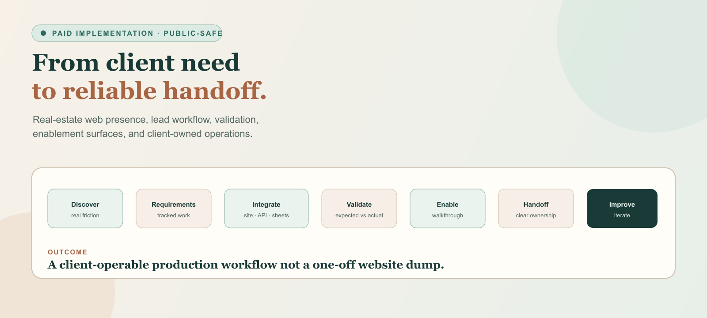
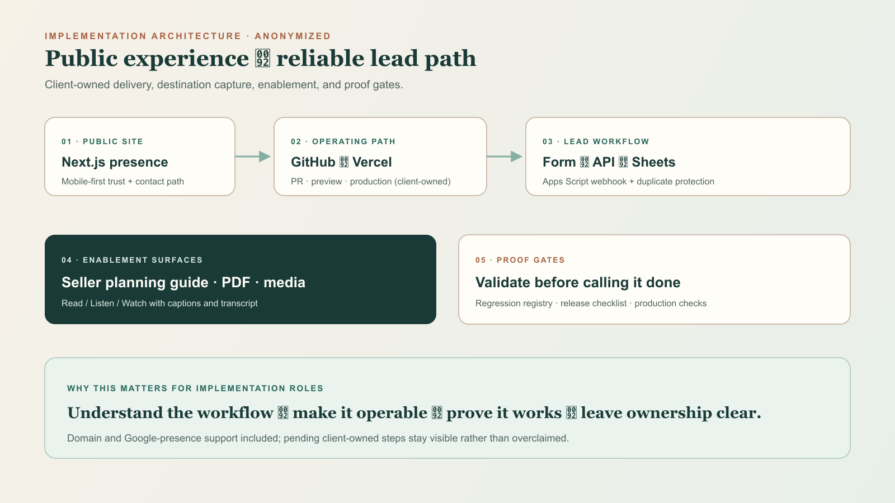
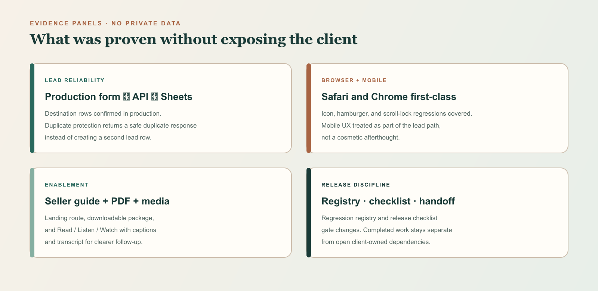

# Paid Client Implementation — Real Estate Web + Lead Workflow

<p align="center">
  
</p>

**From an ambiguous client objective to a reliable, client-operable production workflow.**

```text
Discover → Requirements → Configure & Integrate → Validate → Enable → Handoff → Improve
```

| | |
| --- | --- |
| **Type** | Paid independent client delivery |
| **Scope** | Real-estate public web presence, lead intake, reliability protections, content/enablement surfaces, and client-owned operating path |
| **Role** | Discovery, requirements translation, configuration/integration, validation, client enablement, documentation, and ongoing iteration |
| **Status** | Live production workflow with continued improvement across multiple documented sessions |
| **Public boundary** | Client identity, private analytics, credentials, sheet contents, secrets, and unverified business-impact metrics are omitted |

---

## The client problem

The client already had credibility in a competitive real-estate practice. The operational gap was not “make a prettier page.”

They needed a **trustworthy public presence** that could turn interest into a **dependable lead path**, with a system the client could actually own and operate after delivery:

- clear public story and contact path for prospective sellers;
- reliable consultation intake that lands somewhere the client can follow up;
- mobile/browser reliability for real visitors;
- client-owned deployment and documentation rather than a fragile one-off handoff;
- later enablement surfaces (seller planning guide, downloadable package, media) that support the conversation after first contact.

In short: move from an incomplete visual mock toward a **client-operable production workflow**.

---

## Discovery → requirements

I started by clarifying audience, desired action, dependencies, ownership, and success conditions:

- Who needs help on the site, and what should they understand before contacting the client?
- What counts as a successful launch versus unfinished follow-up?
- Which content, domain, search-presence, deployment, and lead-flow dependencies are required?
- What must remain client-owned (repo, hosting, lead destination) versus implementer-operated?
- What stays open rather than being silently assumed complete?

Those answers became tracked implementation work, configuration steps, validation checks, and a plain-language walkthrough/handoff plan. Ambiguity was treated as a product risk, not a documentation afterthought.

---

## Implementation architecture

<p align="center">
  
</p>

```text
Public site (Next.js)
        ↓
Client-owned GitHub → PR → Vercel preview → production
        ↓
Consultation form → server API
        ↓
Google Sheets lead capture (Apps Script webhook)
        + duplicate-submission protection
        ↓
Seller planning guide + PDF + Read/Listen/Watch media
        ↓
Regression registry · release checklist · documented handoff
```

**What this path accomplished**

- A public Next.js site delivered through a **client-owned** GitHub → Vercel operating path so changes stay reviewable and deployable after handoff.
- Domain connection and Google-presence setup support so the site can function as part of the client’s real operating workflow.
- A production consultation/lead workflow: form → API → Google Sheets destination for follow-up.
- Reliability protections including duplicate-submission / idempotency handling with automated regression coverage.
- Seller-facing enablement surfaces: planning-guide route, downloadable branded PDF package, and Read / Listen / Watch media with captions and transcript.
- Process artifacts: regression registry, release checklist, validation evidence, and documented handoffs across continued sessions.

---

## Validation and reliability

The work was not treated as complete when the page “looked finished.” Expected-versus-actual checks mattered because a missed lead or a broken mobile menu is an operational failure for the client.

| Concern | What was proven (public-safe) |
| --- | --- |
| Lead path | Production consultation submissions reached the Google Sheets destination |
| Reliability | Duplicate-submission protection verified; replay returns a safe duplicate response instead of creating another row |
| Browser/mobile | Safari and Chrome treated as first-class; icon, hamburger/scroll-lock, and related mobile regressions covered |
| Seller guide | Landing route, PDF download path, and media band validated with regression coverage |
| Release discipline | Release checklist and regression registry used as gates rather than informal “looks good” |

Validation evidence is kept as process proof (tests, checklists, logs). Private sheet rows, submission IDs, analytics dashboards, and credentials are not republished here.

<p align="center">
  
</p>

---

## Client enablement and handoff

Delivery included enablement, not only code:

- walkthrough of day-to-day operation in nontechnical language;
- clear ownership of the GitHub → Vercel path;
- separation of **completed work**, **client-operable next steps**, and **open dependencies** (for example, Google Business Profile verification remaining client-owned when pending);
- documentation the client (or a later operator) can use without reconstructing the project from chat history.

The handoff goal was a system the client can keep using and improving—not a static artifact that only the implementer understands.

---

## What shipped

| Area | Delivered |
| --- | --- |
| Public web presence | Production Next.js real-estate site with mobile-first presentation |
| Operating path | Client-owned GitHub → Vercel preview/production workflow |
| Lead workflow | Consultation form → API → Google Sheets capture |
| Reliability | Duplicate-submission protection + regression coverage |
| Browser quality | Safari/Chrome and mobile UX hardening with regression tests |
| Enablement content | Seller planning guide route, downloadable PDF, Read/Listen/Watch media with captions/transcript |
| Process | Regression registry, release checklist, validation evidence, documented handoffs |
| Continuity | Ongoing iteration across multiple documented sessions (not a single website dump) |

---

## What this demonstrates

| Hiring signal | How this engagement shows it |
| --- | --- |
| Workflow discovery | Started from the real operational gap (credibility without a dependable lead path) |
| Requirements translation | Turned ambiguity into tracked work, ownership boundaries, and success conditions |
| Configuration / integration | Connected site, deployment path, API, Sheets webhook, and enablement surfaces |
| Validation / QA | Proved production lead delivery, dedupe behavior, and browser/mobile regressions |
| User enablement | Walkthrough, ownership docs, and seller-guide surfaces the client can use |
| Documentation / handoff | Separated done work from open dependencies; left a reusable operating path |
| AI-assisted execution with accountability | Used AI to accelerate research, implementation, testing support, and docs while retaining human ownership of scope, review, validation, privacy, communication, and acceptance |

This is **AI implementation / technical solutions evidence** even though the client domain is real estate rather than an AI product: the job was to remove friction between a person’s work and a reliable system.

---

## Boundaries — what this is not claiming

- Not formal B2B SaaS implementation employment, enterprise portfolio ownership, or long-term consulting tenure.
- Not a claim that email/CRM delivery, Search Console, analytics, or Google Business Profile verification are complete where the source record still marks them pending or client-owned.
- Not permission to publish client identity, private sheet data, secrets, rates, or unverified lead-conversion / revenue metrics.
- Not a substitute for client approval of any named public case-study branding.

---

## AI and tool attribution

AI tools accelerated research, drafting, troubleshooting, implementation support, testing assistance, and documentation. I remained responsible for requirements, routing, review, validation, client communication, privacy boundaries, and the accepted result.

Deeper attribution pattern: [Model and tool attribution](MODEL-AND-TOOL-ATTRIBUTION.md).

---

## Related public docs

- [Implementation + AI systems](IMPLEMENTATION-AI-SYSTEMS.md)
- [Capability evidence map](CAPABILITY-EVIDENCE-MAP.md)
- [AI workflow case studies](AI-WORKFLOW-CASE-STUDIES.md)
- [Why → How → What](WHY-HOW-WHAT.md)
