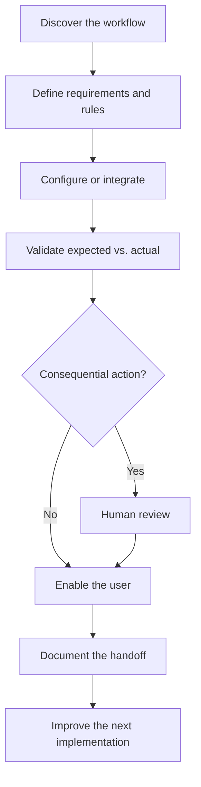

# Hi, I'm Chien Escalera Duong

**AI Implementation & Systems Builder**
Workflow Discovery · Requirements · Configuration · Systems Integration · Validation · Client Enablement

Los Angeles, California · Pacific Time
Open to remote-friendly implementation, AI enablement, solutions, and technical-operations roles

I translate ambiguous real-world problems into working, testable systems that people can understand, operate, and improve.

My working loop is:

```text
Discover the workflow
→ define requirements and business rules
→ configure or integrate the system
→ validate expected versus actual behavior
→ enable the user
→ document the handoff
→ improve the next implementation
```

I am strongest where customers, operations, and technical systems meet. I ask the questions needed to understand the real workflow, organize complexity into concrete requirements, coordinate implementation, test the result, explain it clearly, and leave behind documentation the next person can use.

I use AI to accelerate research, implementation, testing, and documentation while remaining responsible for scope, requirements, evidence review, client communication, and final decisions.

---

## Recruiter quick path

1. **[Paid Client Implementation](docs/PAID-CLIENT-IMPLEMENTATION-CASE-STUDY.md)**
   Discovery, requirements translation, GitHub and Vercel delivery, workflow setup, client walkthrough, and handoff.

2. **[Implementation + AI Systems](docs/IMPLEMENTATION-AI-SYSTEMS.md)**
   My reusable method for moving from an unclear workflow to a configured, validated, human-operable system.

3. **[Autonomous Systems Case Study](https://github.com/heyitschien/autonomous-lab-case-study)**
   Bounded requirements, integration sequencing, evidence-based validation, AI-agent coordination, and human risk gates.

4. **[Cousin Radio Employer Proof](https://github.com/heyitschien/cousin-radio/blob/main/docs/EMPLOYER-PROOF.md)**
   End-to-end product ownership across user discovery, implementation, troubleshooting, QA, deployment, and continued iteration.

---

## Featured implementation proof

<table>
  <tr>
    <td width="50%" valign="top">
      <h3>Paid Client Implementation</h3>
      <!-- IMAGE PLACEHOLDER:
      Add a polished screenshot showing the delivered client website,
      implementation workflow, or client handoff materials.
      -->
      <p>
        Led discovery for a real client, translated priorities into requirements and tracked implementation work, configured and delivered the solution, supported the surrounding domain and Google-presence workflow, and completed a plain-language client walkthrough and handoff.
      </p>
      <p>
        <strong>Demonstrates:</strong> discovery, requirements, configuration, delivery, client enablement, documentation, and implementation ownership.
      </p>
      <p>
        <a href="docs/PAID-CLIENT-IMPLEMENTATION-CASE-STUDY.md"><strong>Read the case study →</strong></a>
      </p>
    </td>
    <td width="50%" valign="top">
      <h3>Autonomous Research Lab</h3>
      <!-- IMAGE PLACEHOLDER:
      Add a system workflow, evaluation dashboard, architecture diagram,
      or redacted validation artifact.
      -->
      <p>
        A complex AI-assisted systems project organized around bounded requirements, deterministic components, test and evaluation gates, observable evidence, documented ownership, and human review before consequential action.
      </p>
      <p>
        <strong>Demonstrates:</strong> systems thinking, implementation sequencing, AI-agent coordination, validation strategy, risk management, and rigorous engineering operations.
      </p>
      <p>
        <a href="https://github.com/heyitschien/autonomous-lab-case-study"><strong>Review the public-safe walkthrough →</strong></a>
      </p>
    </td>
  </tr>
  <tr>
    <td width="50%" valign="top">
      <h3>AI Robotics & Space Systems Lab</h3>
      <!-- IMAGE PLACEHOLDER:
      Add a mission-control dashboard screenshot showing rover telemetry,
      camera data, battery status, or the Webots simulation.
      -->
      <p>
        Built and configured an Apple Silicon-compatible robotics environment connecting Webots simulation, ROS 2, rosbridge, Foxglove, dual WebSocket telemetry paths, and a Next.js mission-control interface.
      </p>
      <p>
        <strong>Demonstrates:</strong> zero-to-one environment setup, cross-stack integration, interface building, troubleshooting, operational documentation, and full-loop validation.
      </p>
      <p>
        <strong>Validated loop:</strong> simulation → ROS 2 topics → telemetry bridges → operator interfaces.
      </p>
    </td>
    <td width="50%" valign="top">
      <h3>Cousin Radio</h3>
      <!-- IMAGE PLACEHOLDER:
      Add a mobile and desktop product screenshot showing the player,
      music library, navigation, or Song Gift experience.
      -->
      <p>
        A live family music platform built from user observation through requirements, implementation, troubleshooting, deployment, QA, and continued product iteration. The product currently supports more than 55 tracks across a mobile-first listening experience.
      </p>
      <p>
        <strong>Demonstrates:</strong> product ownership, customer empathy, frontend delivery, deployment awareness, layered diagnosis, validation, and operating discipline.
      </p>
      <p>
        <a href="https://cousinradio.com"><strong>Visit the live product →</strong></a><br />
        <a href="https://github.com/heyitschien/cousin-radio/blob/main/docs/EMPLOYER-PROOF.md"><strong>Review employer proof →</strong></a>
      </p>
    </td>
  </tr>
</table>

---

## Implementation capabilities

| Capability                        | How I apply it                                                                                                                                    | Evidence                                                                                                                     |
| --------------------------------- | ------------------------------------------------------------------------------------------------------------------------------------------------- | ---------------------------------------------------------------------------------------------------------------------------- |
| Workflow discovery                | Understand the user, current process, friction, dependencies, and definition of success before configuring a solution                             | [Paid Client Implementation](docs/PAID-CLIENT-IMPLEMENTATION-CASE-STUDY.md)                                                  |
| Requirements and business rules   | Convert conversations and ambiguous goals into requirements, boundaries, owners, acceptance criteria, and tracked work                            | [Implementation + AI Systems](docs/IMPLEMENTATION-AI-SYSTEMS.md)                                                             |
| Configuration and integration     | Connect tools, environments, interfaces, deployment systems, and operating workflows in a deliberate sequence                                     | Paid client delivery; AI Robotics & Space Systems Lab                                                                        |
| Expected-versus-actual validation | Compare intended behavior with observable results using screenshots, logs, tests, browser evidence, and repeatable checks                         | [Chrome Extension Tester MCP](https://github.com/heyitschien/chrome-extension-tester-mcp/blob/main/docs/SUPPORT-USE-CASE.md) |
| Client enablement                 | Explain technical systems in practical language, conduct walkthroughs, identify ownership, and leave the user with a clear next action            | [Paid Client Implementation](docs/PAID-CLIENT-IMPLEMENTATION-CASE-STUDY.md)                                                  |
| Issue ownership and handoff       | Maintain status, document decisions, surface open dependencies, and ensure the next owner does not have to restart the investigation              | [Cousin Radio Employer Proof](https://github.com/heyitschien/cousin-radio/blob/main/docs/EMPLOYER-PROOF.md)                  |
| AI coordination                   | Use AI agents for research, implementation, testing support, and documentation while keeping requirements and consequential decisions human-owned | [Autonomous Systems Case Study](https://github.com/heyitschien/autonomous-lab-case-study)                                    |

---

## Selected case studies

### 1. Paid client website and lead-workflow implementation

**Situation**

A real-estate client needed a clearer public presence and a practical way for prospective customers to understand the service and make contact. The work required more than building a webpage: the client needed a usable system, a deployment path, supporting configuration, and a clear handoff.

**My responsibility**

* Conducted discovery and clarified the client’s priorities.
* Translated the conversation into requirements and implementation tasks.
* Configured and delivered a Next.js website through GitHub and Vercel.
* Supported the surrounding domain and Google-presence workflow.
* Validated the public experience across desktop and mobile.
* Walked the client through day-to-day operation.
* Documented ownership, remaining dependencies, and next actions.

**Implementation path**

```text
Client priorities
→ requirements and dependencies
→ tracked implementation work
→ Next.js configuration
→ GitHub version control
→ Vercel deployment
→ domain and Google-presence support
→ validation
→ client walkthrough
→ documented handoff
```

**What it proves**

This is evidence that I can take responsibility for a real customer objective, translate it into technical work, ship a working result, communicate clearly, and leave the client with an operable system.

**[Read the complete case study →](docs/PAID-CLIENT-IMPLEMENTATION-CASE-STUDY.md)**

---

### 2. Autonomous research and evaluation system

**Situation**

A complex systems-research initiative involved multiple technical layers, AI-assisted development, private strategy, operational risk, and a need for reliable evaluation. The project could not be managed as an unstructured collection of prompts and generated code.

**My responsibility**

* Helped frame ambiguous objectives as bounded requirements.
* Directed architecture and implementation decisions.
* Organized work into issues, acceptance criteria, and evidence gates.
* Coordinated specialized AI agents across research, implementation, testing, and documentation.
* Reviewed expected versus actual behavior.
* Required human review before consequential decisions.
* Converted implementation friction into reusable operating documentation.

**Operating model**

```text
Ambiguous objective
→ bounded requirements
→ implementation sequence
→ observable validation
→ risk review
→ human decision
→ documented learning
```

**What it proves**

This project demonstrates that I can organize intelligent tools around a controlled engineering process rather than treating AI output as automatically correct. It shows requirements discipline, test strategy, coordination, risk awareness, and accountable technical decision-making.

**[Review the public-safe case study →](https://github.com/heyitschien/autonomous-lab-case-study)**

---

### 3. AI robotics and space systems integration

**Situation**

The project began as a fragmented collection of robotics technologies that needed to become one understandable and operable system on Apple Silicon.

**My responsibility**

* Configured a ROS 2 Humble environment using Docker and Colima.
* Connected a Webots rover simulation to the ROS environment.
* Implemented separate telemetry paths for the browser interface and Foxglove Studio.
* Built a Next.js mission-control dashboard.
* Validated rover telemetry, battery status, camera data, IMU data, event logs, and transforms.
* Created startup scripts, runbooks, troubleshooting records, and return-to-project documentation.
* Froze a reproducible baseline after validating the complete loop.

**Validated architecture**

```text
Webots rover simulation
→ ROS 2 topic graph
→ rosbridge and foxglove_bridge
→ Next.js mission-control dashboard and Foxglove Studio
→ operator observation and debugging
```

**What it proves**

This project demonstrates that I can enter an unfamiliar technical domain, understand how the components fit together, configure the environment, diagnose integration boundaries, build the operator interface, validate the system, and document how to run it again.

---

### 4. Cousin Radio

**Situation**

My family had music and creative work scattered across disconnected files and services. The opportunity was to turn that content into a simple, emotionally meaningful listening experience that family members could actually use.

**My responsibility**

* Observed user needs and translated them into product requirements.
* Designed and shipped a mobile-first family music experience.
* Built a persistent global player and practical navigation.
* Organized and delivered more than 55 tracks.
* Maintained staging and production deployment paths.
* Added CI checks and media-delivery validation.
* Diagnosed issues across the frontend, catalog, CDN, authentication, and deployment layers.
* Continued improving the product based on real use.

**Product path**

```text
Family need
→ user journey
→ product requirements
→ implementation
→ staging validation
→ production deployment
→ real-world use
→ troubleshooting and iteration
```

**What it proves**

Cousin Radio demonstrates sustained product ownership. It is not a tutorial application: it is a live product requiring decisions about users, architecture, delivery, privacy, QA, troubleshooting, and continued operation.

**[Visit Cousin Radio →](https://cousinradio.com)**
**[Review employer proof →](https://github.com/heyitschien/cousin-radio/blob/main/docs/EMPLOYER-PROOF.md)**

---

## Supporting systems and tools

### Career Development Operating System

A GitHub-based operating system for researching and scoring opportunities, tracking concurrent workstreams, coordinating AI agents, creating proof artifacts, and maintaining durable handoffs.

The system separates:

* research from decision-making;
* opportunity scoring from life and health gates;
* AI recommendations from human-authorized actions;
* active work from durable documentation;
* private operational details from public-safe evidence.

**[Read the public-safe case study →](docs/CAREER-OPERATING-SYSTEM-CASE-STUDY.md)**

### Chrome Extension Tester MCP

A working open-source browser-testing tool for collecting repeatable screenshots, console evidence, environment information, and expected-versus-actual behavior.

It demonstrates how I turn visual or technical observations into evidence that another person can reproduce and act on.

**[See the QA workflow →](https://github.com/heyitschien/chrome-extension-tester-mcp/blob/main/docs/SUPPORT-USE-CASE.md)**

### Local business research and implementation

I research real local-business workflows, identify gaps across customer experience and digital presence, translate findings into prioritized recommendations, and package the work so a business owner can understand the problem and decide what to implement.

This work strengthens the same core capability: moving from messy real-world evidence to a clear, usable operating plan.

---

## How I work

* Start with the person, process, and real friction.
* Ask questions until the actual workflow is understandable.
* Separate confirmed facts from assumptions.
* Convert ambiguity into requirements, owners, boundaries, and success signals.
* Sequence configuration and integration work deliberately.
* Validate claims against observable evidence.
* Communicate status without hiding uncertainty.
* Train the user and document the path.
* Keep consequential decisions human-owned.
* Improve the system after every implementation.



---

## How I use AI

AI increases my speed and range, but it does not remove accountability.

I use AI tools to help with:

* researching unfamiliar systems;
* exploring implementation alternatives;
* drafting and reviewing requirements;
* accelerating configuration and development;
* creating testing strategies;
* collecting and organizing evidence;
* improving documentation;
* maintaining durable project context.

I remain responsible for:

* understanding the user and business objective;
* determining scope and priorities;
* defining acceptance criteria;
* reviewing generated work;
* validating important claims;
* protecting private information;
* communicating with clients and collaborators;
* approving consequential decisions;
* accepting the final result.

---

## Technical foundation

**Implementation and operations**

Workflow discovery · requirements gathering · business-rule translation · configuration · implementation planning · expected-versus-actual validation · client walkthroughs · documentation · issue tracking · handoffs

**Web and product delivery**

JavaScript · React · Next.js · HTML · CSS · Tailwind CSS · REST API and JSON concepts · responsive interfaces · browser developer tools · deployment troubleshooting

**Systems and tooling**

Git · GitHub · GitHub Actions · Vercel · Docker · WebSockets · ROS 2 fundamentals · Webots · Foxglove · Python and SQL fundamentals

**AI-assisted work**

ChatGPT · Cursor · Claude Code · agent orchestration · prompt and context design · model/tool routing · evaluation workflows · human review gates

---

## Background

My background combines technical building with unusually deep experience in human-facing and high-accountability environments.

* **Paid independent implementation:** Discovery, delivery, enablement, and handoff for a real client.
* **High-volume customer operations:** More than 10,000 Uber rides with a 4.9-star rating, followed by frontline customer operations at Whole Foods.
* **Safety-critical production:** Approximately ten years in film and television production, including work on *Avatar: The Way of Water*, *Mulan*, and *From Dusk Till Dawn*.
* **Technical development:** Hands-on work across web products, AI-assisted systems, robotics integration, QA tooling, deployment, and operational documentation.
* **Certificates:** Meta Front-End Developer, Google Cybersecurity, Google AI Essentials.
* **Continuing development:** Python, AI workflows, human systems, technical communication, implementation strategy, and intelligent-system operations.

These experiences trained the same underlying capability: understand the environment, communicate across different people, execute carefully, stay calm when conditions change, and remain accountable for the result.

---

## What I am looking for

I am targeting work where technical systems meet real customers, users, and operators.

Strong role families include:

* Implementation Specialist
* AI Implementation Engineer
* Implementation Architect
* Solutions Engineer
* Customer Solutions
* Technical Operations
* AI Enablement
* Forward-Deployed and customer-facing systems work

I am especially interested in teams that need someone who can learn a complex product, understand the customer’s operating reality, translate requirements across technical and nontechnical groups, validate the implementation, and help the customer become successful with the system.

---

## Scope and evidence boundaries

This portfolio includes:

* paid independent client delivery;
* a live public-beta product;
* private systems represented through public-safe case studies;
* a working open-source QA tool;
* robotics and simulation integration;
* AI-assisted research and implementation workflows;
* educational and synthetic supporting material.

I distinguish these categories clearly.

I do not claim formal enterprise SaaS implementation tenure, banking implementation experience, production financial performance, or senior software-engineering employment. I present the work for what it demonstrates: implementation judgment, systems learning, technical translation, validation discipline, client communication, and the ability to carry difficult work from ambiguity to an operable result.

---

## Contact

**LinkedIn:** [linkedin.com/in/chien-escalera-duong](https://www.linkedin.com/in/chien-escalera-duong/)
**GitHub:** [github.com/heyitschien](https://github.com/heyitschien)
**Email:** [heyitschien@gmail.com](mailto:heyitschien@gmail.com)

Los Angeles, California · Pacific Time · Open to remote-friendly opportunities

---

[Implementation + AI Systems](docs/IMPLEMENTATION-AI-SYSTEMS.md) · [Why → How → What](docs/WHY-HOW-WHAT.md) · [AI Attribution](docs/MODEL-AND-TOOL-ATTRIBUTION.md)
